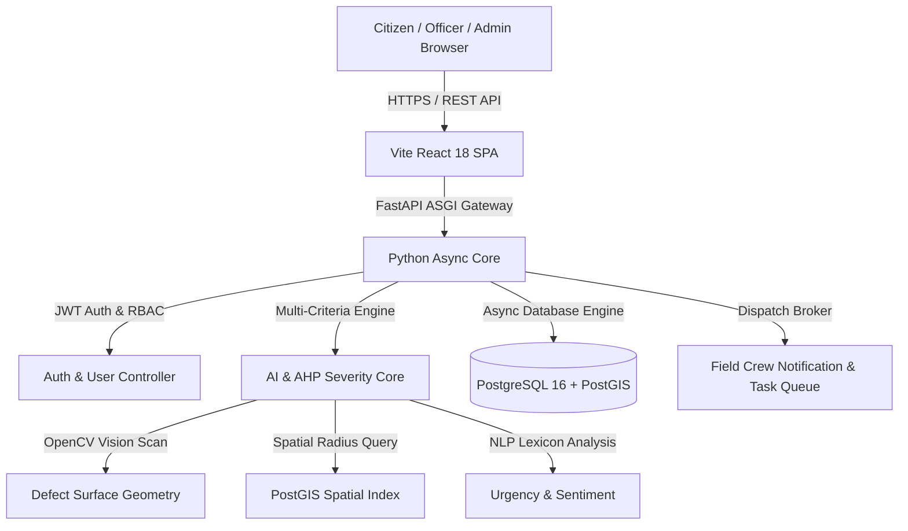

# 🏙️ Smart City Infrastructure and Management System

An AI-Powered, Full-Stack Municipal Infrastructure Monitoring, Multi-Facility Severity Triage, Real-Time IoT Telemetry, and Dynamic Resource Dispatch Platform.

---

## 🌟 Major Project Highlights & Key Innovations

- **Multi-Facility Municipal Management**:
  - 🛣️ **Roads & Highways**: Pothole cavity detection, asphalt fracture analysis, rutting.
  - 🌉 **Bridges & Flyovers**: Expansion joint integrity, micro-strain vibration monitoring.
  - 💧 **Water Networks & Drainage**: Pipeline burst localization, stormwater backflow prevention.
  - 💡 **Smart Streetlights & Traffic Grid**: Luminaire outage clustering, solar sensor monitoring.
  - 🚯 **Smart Waste & Sanitation**: Bin fill-level alerts, illegal dumping detection.
  - ⚡ **Power Grid & Substations**: Transformer temperature monitoring, feeder load tracking.
  - 🌳 **Public Parks & Green Spaces**: Geo-tagged hazard audit trails, barrier inspection.
  - 🚌 **Public Transit & Terminals**: Shelter defect reporting, tactile pavement analysis.

- **Multi-Modal AI & Mathematical Scoring Core**:
  - **Computer Vision Pipeline**: OpenCV morphological cavity depth calculation, Otsu surface segmentation, and crack texture density extraction.
  - **GIS Spatial Vulnerability Engine**: PostGIS spatial indexing assessing proximity to hospitals, school corridors, and critical transit arteries.
  - **Natural Language Urgency NLP**: Token urgency classification and citizen sentiment weighting.
  - **AHP Composite Severity Index**: Analytic Hierarchy Process ($S = w_1 \cdot \text{CV} + w_2 \cdot \text{GIS} + w_3 \cdot \text{NLP} + w_4 \cdot \text{Crowd}$).

- **Faculty & Academic Viva Showcase Mode**:
  - Dedicated interactive architecture review hub with dynamic AHP weight calibrator, real-time IoT multi-facility stream simulator, and comprehensive defense Q&A.

- **Role-Based Access Control (RBAC 3-Tier Security)**:
  - 👑 **Super Admin**: Executive municipal intelligence, department SLA analytics, user/officer provisioning.
  - 👮 **Field Officer**: Real-time dispatch queue, turn-by-turn GIS navigation, before/after repair proof inspection.
  - 👤 **Citizen Reporter**: Multi-facility reporting, AI pre-scan preview, voice note memos, community voting.

---

## 🏗️ System Architecture



---

## 🚀 Quick Start (1-Click Run)

### 🪟 Windows
Double-click `start_windows.bat` or run in terminal:
```cmd
start_windows.bat
```

### 🍎 macOS / 🐧 Linux
Make executable and run:
```bash
chmod +x start_unix.sh seed_database.sh
./start_unix.sh
```

### 🐳 Docker Compose
```bash
docker compose up --build
```

---

## 🛠️ Manual Development Setup

### 1. Backend (FastAPI + Python 3.10+)
```bash
cd backend
python -m venv venv
# On Windows:
.\venv\Scripts\activate
# On Linux/macOS:
source venv/bin/activate

pip install -r requirements.txt
python seed_all_accounts.py
python -m uvicorn main:app --host 0.0.0.0 --port 8005 --reload
```
- **Backend API**: `http://localhost:8005`
- **Interactive Swagger Docs**: `http://localhost:8005/docs`

### 2. Frontend (React 18 + Vite + Tailwind/Vanilla CSS)
```bash
cd frontend/cityreport
npm install
npm run dev
```
- **Frontend App**: `http://localhost:3005`

---

## 🔑 Default User Accounts & Demo Credentials

| Role | Email | Password | Access Level |
|---|---|---|---|
| **Super Admin** | `tarunta850@gmail.com` | `password123` | Executive Command Hub, User Provisioning, Analytics |
| **Field Officer** | `priya.officer@city.gov` | `password123` | Field Response, Status Triage, Proof Upload |
| **Citizen (Public)** | `citizen@example.com` | `citizen123` | Defect Reporting, AI Scanner, Tracking & Upvoting |

---

## 📂 Project Directory Structure

```
smart-city-infrastructure/
├── backend/
│   ├── ai_analysis.py          # OpenCV Computer Vision & NLP Severity Engine
│   ├── database.py             # Async SQLAlchemy Engine & Session
│   ├── main.py                 # FastAPI Application & Reverse Proxy Mounts
│   ├── models.py               # Database Models (Users, Reports, Teams, etc.)
│   ├── schemas.py              # Pydantic Validation Schemas
│   ├── seed_all_accounts.py    # Database Seeding Utility
│   ├── requirements.txt        # Backend Python Dependencies
│   └── routers/
│       ├── auth.py             # JWT Authentication & RBAC
│       ├── reports.py          # Report Submission, AI Scoring & Queries
│       ├── admin.py            # Admin Officer Management & Stats
│       └── analytics.py        # Municipal Multi-Factor Analytics
├── frontend/
│   └── cityreport/
│       ├── src/
│       │   ├── components/     # UI Components (Navbar, AI Cards, Faculty Modal)
│       │   ├── pages/
│       │   │   ├── auth/       # Welcome, Login, Signup Pages
│       │   │   ├── officer/    # Officer Command & Triage Dashboard
│       │   │   ├── citizen/    # Citizen Reporting & GIS Map Portal
│       │   │   └── admin/      # Admin Executive Hub & Analytics
│       │   ├── utils/          # Image helpers & API client
│       │   ├── index.css       # Global Cyber-Civic Design Tokens & Themes
│       │   └── App.jsx         # App Routing & Providers
│       └── package.json
├── docker-compose.yml          # Multi-container Docker Orchestration
├── render.yaml                 # Cloud Deployment Blueprint
├── start_windows.bat           # Windows 1-Click Launcher
├── start_unix.sh               # Unix/macOS 1-Click Launcher
├── seed_database.bat           # Windows Database Seeder Script
└── streamlit_app.py            # Streamlit Companion Telemetry App
```

---

## 🎓 Academic Defense & Faculty Viva Talking Points

1. **Analytical Rigor**: Uses the **Analytic Hierarchy Process (AHP)** to avoid bias in emergency dispatch.
2. **True Geodetic GIS**: Utilizes **PostGIS R-Tree spatial indexing** over the WGS 84 ellipsoid (EPSG:4326) for radius-based deduplication.
3. **Closed-Loop Verification**: Double-verification loop requiring geo-tagged before/after inspection imagery with citizen dispute resolution before final sign-off.
